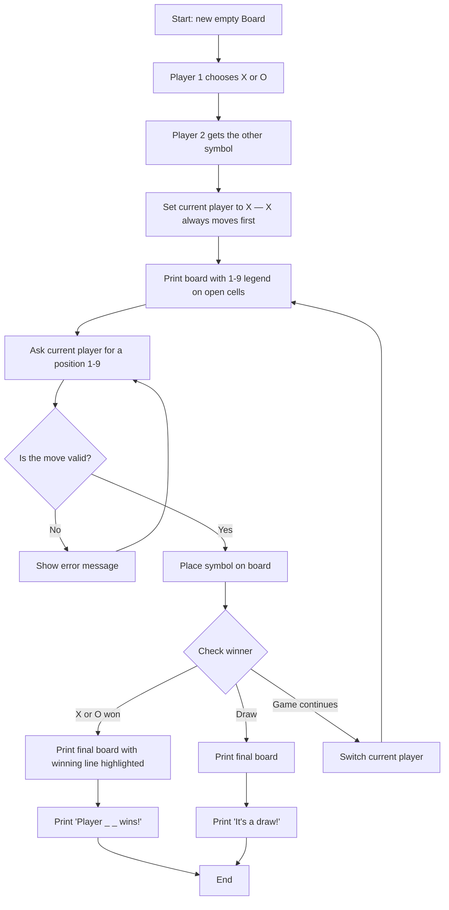

# Tic-Tac-Toe — Phase 1 Technical Documentation

**Project:** Tic-Tac-Toe (single-player, local, terminal-based)
**Phase:** 1 of 3 (basic game — no AI, no networking)
**Author:** Prof Arko
**Status:** Complete, tested, ready for review

This document explains what Phase 1 is, why it's built the way it is, and how every piece of it works. It's written so someone with no prior context — a recruiter, a teammate, or future me — can read it top to bottom and fully understand the project.

---

## 1. What this project is

A two-player Tic-Tac-Toe game that runs in a terminal. Player 1 picks a symbol (X or O) and Player 2 automatically gets the other one; X always moves first regardless of who chose it. Each turn, the board shows position numbers 1-9 in every open cell, so players always know exactly what to type. No graphics, no AI, no network — that comes in later phases. Phase 1's job is to get the *rules* and *game loop* right, with clean structure, because everything later (an AI opponent in Phase 2, an online multiplayer server in Phase 3) gets built on top of this foundation without rewriting it.

## 2. Folder structure

```
tic_tac_toe/
├── PHASE1_TECHNICAL_DOCUMENTATION.md   ← this file
└── single_player/
    ├── board.py                       ← game state & rules (no I/O)
    ├── game.py                        ← game loop & terminal I/O
    └── main.py                        ← entry point (run this)

```

Why split into three files instead of one script? Each file has exactly one job:

| File | Job | Talks to terminal? | Depends on |
|---|---|---|---|
| `board.py` | Store the grid, enforce the rules | No | Nothing |
| `game.py` | Run the turn-by-turn loop, ask for input, print feedback | Yes | `board.py` |
| `main.py` | Start the program | No (just calls `game.py`) | `game.py` |

This is the **separation of concerns** principle: logic that decides *whether a move is legal* should never be tangled up with logic that *asks a human for that move*. The payoff shows up immediately in testing — `tests/test_board.py` calls `Board` methods directly and checks the results, with no `input()` to fake and no terminal output to parse.

## 3. Architecture decisions

These are the choices a reviewer is most likely to ask about, and the reasoning behind each one.

**Why a `Board` class instead of a plain list + free functions?**
A class bundles the 3x3 grid together with the operations that are only meaningful in the context of that grid (`is_valid_move`, `check_winner`, etc.). It also gives Phase 2 and Phase 3 a single object to pass around — the AI simulates moves on a `Board`, and the future multiplayer server keeps one `Board` per room.

**Why does `Board` only manage state, never print anything?**
So it can be unit-tested with plain assertions, and so it can be reused unchanged when the game moves from "print to terminal" (Phase 1) to "send JSON over a websocket" (Phase 3). If `Board` printed to the terminal itself, the networked version would have no way to reuse it.

**Why is the board stored as a flat list of 9 cells instead of a 3x3 nested list (`list[list[str]]`)?**
A flat list makes "win line" checks a single tuple of three indices — `(0, 1, 2)` for the top row — instead of two-dimensional indexing (`grid[0][0]`, `grid[0][1]`...). It's a small simplification, but it removes a whole category of off-by-one row/column bugs. The trade-off is that `render()` has to slice the list back into rows for display — a fair price for simpler rule-checking.

**Why loop-and-retry on bad input instead of validating once and crashing on failure?**
A terminal game's most common "bug report" is a typo. `ask_for_move` in `game.py` re-prompts on anything invalid — non-numeric input, out-of-range numbers, or an already-taken cell — so a mistyped character never ends the session. This matters more here than it would in, say, a batch data script, because the *user* is a human typing in real time.

**Why `check_winner()` returns a string (`"X"`, `"O"`, `"draw"`, or `None`) instead of, say, an enum or a tuple of `(is_over, winner)`?**
For a project this size, four possible values with obvious meaning are easier to read at a call site (`if result == "draw":`) than an enum import or a tuple to unpack. This is a deliberate "don't over-engineer for the current scale" choice — see the Constraints/Trade-offs section for when this stops being the right call.

**Why is there no `Player` class?**
There's currently nothing to store about a player beyond their symbol ('X' or 'O'), so a class would be a wrapper around one string. Introducing it now would be speculative complexity. It becomes worth adding once players need names, scores across rounds, or a network identity (flagged as a Phase 2/3 concern below).

**Why does Player 1 choose a symbol and Player 2 just gets the leftover, instead of both players choosing independently?**
Letting both players pick independently means handling the case where they pick the same one — extra validation, extra error messages, for a decision that only has two possible outcomes anyway. Deriving Player 2's symbol from Player 1's choice (`resolve_symbols`) makes the conflict structurally impossible instead of something you have to detect and reject.

**Why does 'X' always move first, even if Player 1 chose 'O'?**
Turn order and symbol choice are two different decisions, and tying them together (whoever picks first, or whoever is "Player 1," moves first) is an implicit rule that's easy to get wrong once more logic depends on turn order — the Phase 3 networked version, for instance, needs an unambiguous first-mover rule that doesn't depend on message arrival order. Fixing "X moves first" as a constant, independent of who picked it, removes that ambiguity entirely.

**Why show position numbers (1-9) in empty cells instead of leaving them blank, and why not have a separate "show open positions" function?**
A blank cell tells the player nothing about what to type there. Printing the position number *in* the empty cell means the board rendering doubles as the input legend — there's no second function to keep in sync with the first, and no risk of the "available moves" list drifting out of sync with the actual board state.

**Why does `check_winner()` also record `winning_line` as a side effect, instead of a second method like `get_winning_line()`?**
The winning line only exists *because* `check_winner()` just determined there is one — computing it in a second pass would repeat the same loop over `WINNING_LINES` for no benefit. Storing it as a side effect on the object it belongs to (the board that was just won on) is a normal, well-contained use of state, not the same thing as the "no global mutable state" principle below (which is about avoiding state shared *across* unrelated parts of the program).

## 4. Flowchart — one full game



## 6. Code walkthrough

### 6.1 `board.py`

**`WINNING_LINES`** — a tuple of the 8 index triples that count as a win (3 rows, 3 columns, 2 diagonals). Defined once at module level, not recomputed per game, since it's the same for every `Board` instance.

**`Board.__init__`** — creates `self.cells`, a list of 9 `" "` (empty) strings. `O(1)`.

**`Board.is_valid_move(position)`** — returns `True` only if `position` is between 0 and 8 *and* that cell is empty. `O(1)`. This is called before every `make_move`, so illegal moves never reach the board's actual state — the validation and the mutation are two separate method calls, not one, so each can be tested and reasoned about independently.

**`Board.make_move(position, symbol)`** — writes `symbol` into `cells[position]`. Deliberately does *no* validation — it trusts the caller already checked `is_valid_move`. This keeps the method simple and single-purpose; combining "check + write" into one method would make it harder to test each behavior separately.

**`Board.undo_move(position)`** — clears a cell back to empty. Not used anywhere in Phase 1's game loop, but required by Phase 2's minimax search, which needs to simulate a move, look ahead, and then take it back. Included now because it's part of `Board`'s natural interface (the inverse of `make_move`), not because Phase 1 needs it — this is the one deliberate exception to "don't build for the future" in this codebase, justified because it's a two-line method with zero added complexity.

**`Board.empty_positions()`** — list comprehension returning indices where `cells[i] == " "`. `O(9)`, effectively constant time on a fixed 3x3 board. Used by the future AI to know which moves are legal to try.

**`Board.check_winner()`** — loops over the 8 `WINNING_LINES`; for each, checks if all three cells match and aren't empty. If it finds one, it records the winning triple in `self.winning_line` before returning the symbol. If none match and there are no empty cells left, returns `"draw"`. Otherwise returns `None` (game still in progress) and resets `winning_line` back to `None` first, so a stale highlight can never leak from a previous call. `O(8)` per call — negligible, and simple enough that a smarter algorithm isn't worth the readability cost at this board size.

**`Board.render()`** — slices the flat 9-cell list into three rows of 3 and joins them with `" | "` and a `-+-` separator line. Empty cells display their 1-9 position number rather than a blank; if `winning_line` is set, the three matching cells get wrapped in asterisks (`*X*`) so the win is visually obvious, not just stated in text.

### 6.2 `game.py`

**`other_symbol(symbol)`** — one-line helper to flip `'X'` to `'O'` and back. Pulled out as its own function (rather than inlined elsewhere) purely for readability at the call site: `current_symbol = other_symbol(current_symbol)` reads as a sentence.

**`resolve_symbols(player1_choice)`** — pure function, no `input()`/`print()`: given Player 1's choice, validates it's 'X' or 'O' (case-insensitive) and returns `(player1_symbol, player2_symbol)`. Kept separate from the prompt that collects the choice specifically so it can be unit tested with plain assertions — `tests/test_game.py` does exactly that.

**`ask_player1_symbol()`** — the interactive counterpart to `resolve_symbols`: loops until Player 1 types 'X' or 'O', case-insensitively. Player 2 never gets asked — their symbol is derived, not chosen, which is what rules out both players picking the same one.

**`ask_for_move(player_label, board)`** — an infinite loop that: reads a line of input, checks it's all digits, converts to `int`, subtracts 1 to translate the player-facing 1-9 numbering into the board's internal 0-8 indexing, then checks `board.is_valid_move`, returning only once all three checks pass. Every failure path prints a specific, actionable message ("enter a number between 1 and 9" vs. "that spot is taken") rather than a generic "invalid input."

**`play_game()`** — the actual game loop: create a `Board`, collect Player 1's symbol and derive Player 2's, build a `label_for_symbol` lookup so prompts read "Player 1 (O)" instead of just "O", then start with `'X'` (always, regardless of who chose it) and repeat {print board → ask for move → apply move → check winner → switch player} until `check_winner()` returns something other than `None`. Then print the final board (with the winning line starred, if there is one) and the appropriate result message.

### 6.3 `main.py`

Two lines of real code: import `play_game`, and call it inside `if __name__ == "__main__":`. This guard means `game.py` and `board.py` can be imported by test files or by a future module without accidentally starting an interactive game session.


## 9. How to run it

```bash
cd tic_tac_toe/single_player
python3 main.py
```

Player 1 will be asked to choose X or O; Player 2 automatically gets the other symbol. X always moves first. You'll be prompted for positions 1-9 (matching the numbers shown on the board), alternating players, until someone wins — with the winning line starred — or the board fills up.

To run the test suite:

```bash
cd tic_tac_toe/single_player
pytest tests/ -v
```

## 11. What comes next

Phase 2 adds a minimax-based AI opponent by adding one new function that consumes the same `Board` (including the already-built `undo_move`) — no changes to `board.py`'s public interface are needed. Phase 3 replaces `game.py`'s terminal I/O with a websocket server/client pair while `board.py` is reused as-is. Both are proof that the Phase 1 split between "rules" and "I/O" was worth the extra file.
